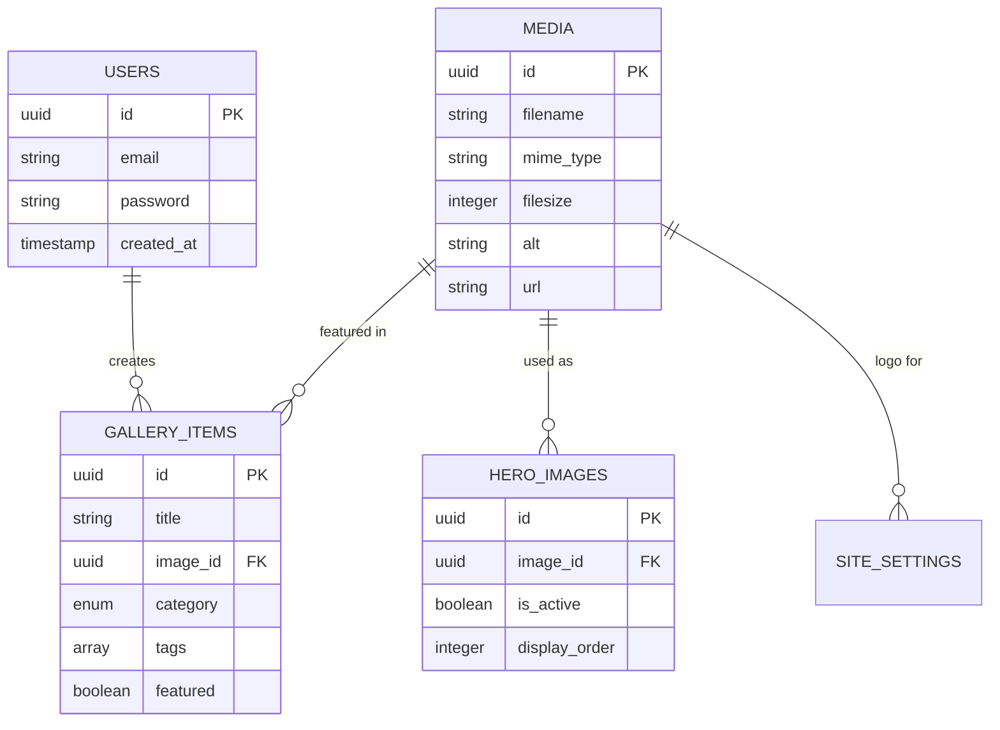

# System Architecture Documentation

Comprehensive architectural overview of the portfolio project, including system design, data flow, integration patterns, and technical decisions.

## Architecture Overview

### System Type
**Headless CMS Architecture** - Decoupled frontend and backend with API-driven content management.

### High-Level Architecture Diagram

```
┌─────────────────┐    ┌─────────────────┐    ┌─────────────────┐
│   Client Layer  │    │  Application    │    │   Data Layer    │
│                 │    │     Layer       │    │                 │
│  ┌───────────┐  │    │  ┌───────────┐  │    │  ┌───────────┐  │
│  │  Browser  │  │◄──►│  │  Next.js  │  │◄──►│  │PostgreSQL│  │
│  │           │  │    │  │ Frontend  │  │    │  │ Database  │  │
│  └───────────┘  │    │  └───────────┘  │    │  └───────────┘  │
│                 │    │  ┌───────────┐  │    │  ┌───────────┐  │
│  ┌───────────┐  │    │  │ PayloadCMS│  │◄──►│  │   Media   │  │
│  │   Admin   │  │◄──►│  │  Backend  │  │    │  │  Storage  │  │
│  │    UI     │  │    │  └───────────┘  │    │  └───────────┘  │
│  └───────────┘  │    │                 │    │                 │
└─────────────────┘    └─────────────────┘    └─────────────────┘
```

---

## Core Technologies

### Technology Stack

| Layer | Technology | Version | Purpose |
|-------|------------|---------|---------|
| **Frontend** | Next.js | 15.3.0 | React framework with App Router |
| **Backend** | PayloadCMS | 3.33.0 | Headless CMS and API |
| **Database** | PostgreSQL | 15+ | Primary data storage |
| **Runtime** | Node.js | 18.20.2+ | Server runtime |
| **Language** | TypeScript | 5.7.3 | Type-safe development |
| **Styling** | Tailwind CSS | 4.1.3 | Utility-first CSS |
| **Package Manager** | pnpm | 9/10 | Fast, efficient package management |

### Key Dependencies

**Frontend Dependencies**:
- **React 19.1.0** - UI library with concurrent features
- **Framer Motion 12.7.4** - Animation library
- **Sharp 0.32.6** - Image processing
- **Mux Player 3.4.0** - Video streaming

**Backend Dependencies**:
- **@payloadcms/db-postgres** - PostgreSQL adapter
- **@payloadcms/richtext-lexical** - Rich text editor
- **cross-env** - Environment variable management

---

## Architectural Patterns

### 1. Headless CMS Pattern

**Benefits**:
- **Decoupled Development**: Frontend and backend teams can work independently
- **Multi-Channel Content**: Same content can serve web, mobile, and other platforms
- **Technology Flexibility**: Can swap frontend frameworks without affecting content
- **Performance**: Static generation with dynamic content updates

**Implementation**:
```typescript
// Frontend data fetching
async function getGalleryItems(): Promise<GalleryItem[]> {
  const response = await fetch(`${process.env.NEXT_PUBLIC_SERVER_URL}/api/gallery-item`);
  const data = await response.json();
  return data.docs;
}

// Backend collection definition
export const GalleryItem: CollectionConfig = {
  slug: 'gallery-item',
  fields: [
    { name: 'title', type: 'text', required: true },
    { name: 'image', type: 'relationship', relationTo: 'media' },
    { name: 'category', type: 'select', options: ['human', 'non-human'] }
  ]
};
```

### 2. Route Group Architecture

**Directory Structure**:
```
src/
├── app/
│   ├── (frontend)/      # Public-facing website
│   │   ├── page.tsx    # Homepage
│   │   ├── gallery/    # Gallery routes
│   │   └── layout.tsx  # Frontend layout
│   └── (payload)/      # CMS and API
│       ├── admin/      # Admin interface
│       ├── api/        # REST/GraphQL endpoints
│       └── layout.tsx  # Admin layout
└── features/           # Feature-based modules
    ├── gallery-management/
    ├── video-showcase/
    ├── social-book/
    └── shared/
```

**Benefits**:
- **Clear Separation**: Frontend and backend code are logically separated
- **Independent Routing**: Each group has its own routing logic
- **Shared Resources**: Common utilities can be shared between groups

### 3. Vertical Slice Architecture (VSA)

**Feature-Based Structure**:
```
src/features/
├── gallery-management/
│   ├── components/     # Gallery-specific components
│   ├── hooks/         # Gallery hooks (useSwipe)
│   ├── services/      # Gallery data fetching
│   └── types/         # Gallery TypeScript types
├── video-showcase/
│   └── components/    # Video player components
├── social-book/
│   └── components/    # Social book components
└── shared/
    ├── components/    # Shared layout & sections
    ├── ui/           # Reusable UI components
    ├── services/     # Shared services
    └── utils/        # Shared utilities
```

**Benefits**:
- **Feature Cohesion**: All code for a feature lives together
- **Clear Boundaries**: Easy to understand feature scope
- **Independent Development**: Teams can work on features in isolation
- **Better Scalability**: Features can be extracted to microservices

---

## Data Architecture

### Database Schema

**Core Collections**:

```sql
-- Users (Authentication)
users {
  id: UUID PRIMARY KEY
  email: VARCHAR UNIQUE
  password: VARCHAR (hashed)
  created_at: TIMESTAMP
  updated_at: TIMESTAMP
}

-- Media (File Storage)
media {
  id: UUID PRIMARY KEY
  filename: VARCHAR
  mime_type: VARCHAR
  filesize: INTEGER
  width: INTEGER
  height: INTEGER
  alt: TEXT
  url: VARCHAR
  created_at: TIMESTAMP
}

-- Gallery Items
gallery_items {
  id: UUID PRIMARY KEY
  title: VARCHAR
  image_id: UUID REFERENCES media(id)
  category: ENUM('human', 'non-human')
  tags: TEXT[]
  featured: BOOLEAN DEFAULT false
  created_at: TIMESTAMP
  updated_at: TIMESTAMP
}

-- Hero Images
hero_images {
  id: UUID PRIMARY KEY
  image_id: UUID REFERENCES media(id)
  is_active: BOOLEAN DEFAULT true
  display_order: INTEGER
  created_at: TIMESTAMP
}

-- Site Settings
site_settings {
  id: UUID PRIMARY KEY
  site_title: VARCHAR
  site_description: TEXT
  logo_image_id: UUID REFERENCES media(id)
  contact_email: VARCHAR
  social_links: JSONB
  updated_at: TIMESTAMP
}
```

### Data Relationships



---

## Data Flow Architecture

### 1. Content Management Flow

```
Admin User → PayloadCMS Admin → Database → API Cache → Frontend
     ↓
1. Login to /admin
2. Upload media files
3. Create gallery items
4. Publish content
5. Content available via API
6. Frontend fetches and displays
```

### 2. User Interaction Flow

```
User Request → Next.js Router → Page Component → Data Fetching → Rendering
     ↓
1. User visits /gallery/human
2. Next.js matches route
3. Page component loads
4. Fetch gallery data from API
5. Render gallery with images
6. Handle user interactions
```

### 3. API Data Flow

**REST API Flow**:
```typescript
// 1. Client Request
GET /api/gallery-item?category=human&limit=20

// 2. PayloadCMS Processing
const items = await payload.find({
  collection: 'gallery-item',
  where: { category: { equals: 'human' } },
  limit: 20,
  depth: 1 // Include related media
});

// 3. Response
{
  docs: [...items],
  totalDocs: 45,
  limit: 20,
  page: 1,
  hasNextPage: true
}
```

**GraphQL Flow**:
```graphql
# 1. Client Query
query GetGalleryItems($category: String!) {
  GalleryItems(where: { category: { equals: $category } }) {
    docs {
      id
      title
      image {
        url
        alt
      }
    }
  }
}

# 2. Resolver Processing
# PayloadCMS automatically resolves relationships

# 3. Response
{
  "data": {
    "GalleryItems": {
      "docs": [...]
    }
  }
}
```

---

## Integration Architecture

### 1. Media Processing Pipeline

```
Upload → Sharp Processing → Storage → CDN → Delivery
   ↓
1. File uploaded via admin
2. Sharp resizes/optimizes
3. Stored in filesystem/S3
4. Served via Next.js Image
5. Cached and optimized
```

**Implementation**:
```typescript
// Media collection with Sharp processing
export const Media: CollectionConfig = {
  slug: 'media',
  upload: {
    staticURL: '/media',
    staticDir: 'media',
    imageSizes: [
      {
        name: 'thumbnail',
        width: 400,
        height: 300,
        position: 'centre',
      },
      {
        name: 'card',
        width: 768,
        height: 1024,
        position: 'centre',
      },
    ],
    adminThumbnail: 'thumbnail',
    mimeTypes: ['image/*'],
  },
};
```

### 2. Video Streaming Integration

**Mux Player Architecture**:
```
Video Upload → Mux Processing → Adaptive Streaming → Player
     ↓
1. Video uploaded to Mux
2. Mux processes multiple bitrates
3. Adaptive streaming based on connection
4. Mux Player handles playback
```

**Implementation**:
```tsx
// Video showcase component
import MuxPlayer from '@mux/mux-player-react';

export function DisplayMovie({ videoId }: { videoId: string }) {
  return (
    <MuxPlayer
      playbackId={videoId}
      metadata={{
        video_title: "Artist Documentary",
        viewer_user_id: "user-123"
      }}
      streamType="on-demand"
      controls
      autoPlay={false}
    />
  );
}
```

### 3. 3D Model Integration

**Sketchfab Embedding**:
```
3D Model → Sketchfab Upload → Embed Code → iframe Integration
     ↓
1. 3D scan uploaded to Sketchfab
2. Configure viewer settings
3. Generate embed code
4. Integrate in React component
```

**Implementation**:
```tsx
// 3D exhibition viewer
export function ExhibitionViewer({ modelId }: { modelId: string }) {
  return (
    <iframe
      src={`https://sketchfab.com/models/${modelId}/embed`}
      width="100%"
      height="600"
      frameBorder="0"
      allow="autoplay; fullscreen; vr"
      mozallowfullscreen="true"
      webkitallowfullscreen="true"
    />
  );
}
```

---

## Security Architecture

### 1. Authentication & Authorization

**JWT-Based Authentication**:
```typescript
// Login flow
POST /api/users/login
{
  "email": "admin@portfolio.com",
  "password": "secure-password"
}

// Response with JWT
{
  "token": "eyJhbGciOiJIUzI1NiIsInR5cCI6IkpXVCJ9...",
  "user": { "id": "...", "email": "..." },
  "exp": 1705320600
}

// Protected requests
Authorization: Bearer <token>
```

**Role-Based Access Control**:
```typescript
// User collection with roles
export const Users: CollectionConfig = {
  slug: 'users',
  auth: true,
  access: {
    admin: ({ req: { user } }) => user?.role === 'admin',
    create: ({ req: { user } }) => user?.role === 'admin',
    read: () => true, // Public read access
    update: ({ req: { user } }) => user?.role === 'admin',
    delete: ({ req: { user } }) => user?.role === 'admin',
  },
};
```

### 2. Data Validation

**Input Validation**:
```typescript
// Collection field validation
{
  name: 'email',
  type: 'email',
  required: true,
  validate: (val: string) => {
    if (!val.includes('@')) {
      return 'Please enter a valid email';
    }
    return true;
  }
}
```

### 3. Environment Security

**Environment Variables**:
```bash
# Required secrets
PAYLOAD_SECRET=<32-character-secret>
POSTGRES_PASSWORD=<secure-password>

# Optional security headers
NEXT_PUBLIC_SERVER_URL=https://portfolio.com
```

---

## Performance Architecture

### 1. Caching Strategy

**Multi-Level Caching**:
```
Browser Cache → CDN Cache → Next.js Cache → Database
     ↓
1. Browser caches static assets
2. CDN caches images and media
3. Next.js caches API responses
4. Database query optimization
```

**Implementation**:
```typescript
// API route with caching
export async function GET(request: Request) {
  const galleryItems = await payload.find({
    collection: 'gallery-item',
    limit: 20,
  });

  return Response.json(galleryItems, {
    headers: {
      'Cache-Control': 'public, s-maxage=300, stale-while-revalidate=600'
    }
  });
}
```

### 2. Image Optimization

**Next.js Image Pipeline**:
```typescript
// Optimized image component
import Image from 'next/image';

export function GalleryImage({ src, alt }: ImageProps) {
  return (
    <Image
      src={src}
      alt={alt}
      width={800}
      height={600}
      sizes="(max-width: 768px) 100vw, 50vw"
      priority={false} // Lazy load by default
      placeholder="blur"
      blurDataURL="data:image/jpeg;base64,..."
    />
  );
}
```

### 3. Code Splitting

**Automatic Splitting**:
```typescript
// Dynamic imports for heavy components
const HeavyGallery = dynamic(() => import('./HeavyGallery'), {
  loading: () => <GalleryLoader />,
  ssr: false // Client-side only
});

// Route-based splitting (automatic with App Router)
app/
├── gallery/
│   └── page.tsx     # Separate bundle
├── about/
│   └── page.tsx     # Separate bundle
└── page.tsx         # Main bundle
```

---

## Deployment Architecture

### 1. Build Process

**Production Build Pipeline**:
```bash
# 1. Install dependencies
pnpm install --frozen-lockfile

# 2. Generate types
pnpm generate:types

# 3. Build application
pnpm build

# 4. Start production server
pnpm start
```

### 2. Environment Configuration

**Multi-Environment Setup**:
```
Development → Staging → Production
     ↓
1. Local development with hot reload
2. Staging environment for testing
3. Production with optimizations
```

**Environment Variables**:
```typescript
// Environment-specific configuration
const config = {
  development: {
    database: 'postgresql://localhost:5432/portfolio_dev',
    debug: true,
    logLevel: 'debug'
  },
  production: {
    database: process.env.DATABASE_URL,
    debug: false,
    logLevel: 'error'
  }
};
```

### 3. Monitoring & Logging

**Application Monitoring**:
```typescript
// Error tracking
import * as Sentry from '@sentry/nextjs';

Sentry.init({
  dsn: process.env.SENTRY_DSN,
  environment: process.env.NODE_ENV,
});

// Performance monitoring
export function reportWebVitals(metric: NextWebVitalsMetric) {
  console.log(metric);
  // Send to analytics service
}
```

---

## Future Architecture Evolution

### 1. Implemented Architecture Patterns

**VSA Implementation Complete**:
- ✅ Feature-based directory structure implemented
- ✅ All components migrated to appropriate features
- ✅ Import paths updated to use @/features pattern
- ✅ Clear separation of concerns by feature

**Current VSA Structure**:
```
src/features/
├── gallery-management/    # Complete gallery feature
│   ├── components/       # Gallery UI components
│   ├── hooks/           # useSwipe hook
│   ├── services/        # galleryData service
│   └── types/           # Gallery TypeScript types
├── video-showcase/       # Video display feature
│   └── components/      # DisplayMovie component
├── social-book/          # Social book feature
│   └── components/      # SocialBook component
└── shared/              # Cross-feature shared code
    ├── components/      # Layout, sections
    ├── ui/             # Reusable UI components
    ├── services/       # Shared services
    └── utils/          # Shared utilities
```

### 2. Microservices Consideration

**Potential Split**:
```
Portfolio Frontend (Next.js)
├── Gallery Service (PayloadCMS)
├── Media Service (Dedicated)
├── User Service (Auth)
└── Analytics Service
```

### 3. Edge Computing

**Future Optimizations**:
- Edge functions for API routes
- Edge caching for media
- Global CDN distribution
- Real-time updates via WebSockets

---

## Architecture Decision Records (ADRs)

### ADR-001: Headless CMS Choice

**Decision**: Use PayloadCMS instead of traditional CMS
**Rationale**: 
- TypeScript-first approach
- Automatic API generation
- Flexible content modeling
- Developer-friendly admin interface

**Consequences**:
- ✅ Type safety across stack
- ✅ Rapid API development
- ❌ Learning curve for content editors
- ❌ Smaller ecosystem than WordPress

### ADR-002: Database Choice

**Decision**: PostgreSQL over MongoDB
**Rationale**:
- ACID compliance for content integrity
- Better performance for relational data
- Mature ecosystem and tooling
- PayloadCMS PostgreSQL adapter

**Consequences**:
- ✅ Data consistency and reliability
- ✅ Complex queries and relationships
- ❌ Less flexible schema changes
- ❌ Additional setup complexity

### ADR-003: Styling Approach

**Decision**: Tailwind CSS over CSS-in-JS
**Rationale**:
- Utility-first approach
- Excellent performance
- Design system consistency
- Great developer experience

**Consequences**:
- ✅ Fast development and prototyping
- ✅ Consistent design tokens
- ❌ Learning curve for designers
- ❌ Potential class name bloat

---

## Troubleshooting Architecture Issues

### Common Problems

**1. Database Connection Issues**
```bash
# Check connection
psql -h localhost -p 5432 -U portfolio -d portfolio

# Verify environment variables
echo $POSTGRES_HOST $POSTGRES_PORT $POSTGRES_DB
```

**2. API Performance Issues**
```typescript
// Add query optimization
const items = await payload.find({
  collection: 'gallery-item',
  depth: 0, // Reduce relationship depth
  limit: 10, // Limit results
  select: { title: true, image: true } // Select specific fields
});
```

**3. Memory Issues**
```bash
# Increase Node.js memory
NODE_OPTIONS="--max-old-space-size=4096" pnpm dev

# Monitor memory usage
node --inspect pnpm dev
```

---

## Architecture Metrics

### Performance Targets

| Metric | Target | Current |
|--------|--------|---------|
| **First Contentful Paint** | < 1.5s | TBD |
| **Largest Contentful Paint** | < 2.5s | TBD |
| **Time to Interactive** | < 3.0s | TBD |
| **API Response Time** | < 200ms | TBD |
| **Database Query Time** | < 50ms | TBD |

### Scalability Considerations

- **Concurrent Users**: 1,000+ simultaneous users
- **Media Storage**: 10GB+ of images and videos
- **API Throughput**: 1,000+ requests per minute
- **Database Size**: 100,000+ records

---

**Last Updated**: July 7, 2025  
**Architecture Version**: 2.0  
**Next.js Version**: 15.3.0  
**PayloadCMS Version**: 3.33.0
